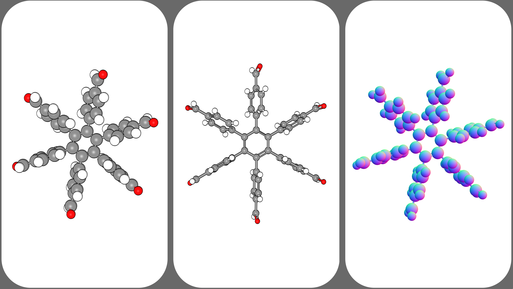

:author: Lukas Turcani
:Documentation: https://pursuit.purescript.org/packages/purescript-mol-draw

=======
molDraw
=======

A lightweight, 3D molecular viewer for embedding molecules into
web pages and web apps, with support for React. It is intended for use
by both JavaScript and PureScript applications.

Live Preview: https://codepen.io/lukasturcani/pen/zYrwgem

------------
Installation
------------

JavaScript
==========

You can install with either yarn::

    $ yarn add mol-draw

or npm::

    $ npm install mol-draw

PureScript
==========

Add the following to your spago_ ``packages.dhall`` file

.. _spago: https://github.com/purescript/spago#add-a-package-to-the-package-set

.. code-block:: dhall

    let additions =
        { molDraw =
            { dependencies =
                [ "arrays"
                , "console"
                , "effect"
                , "either"
                , "integers"
                , "math"
                , "numbers"
                , "ordered-collections"
                , "strings"
                , "stringutils"
                ]
            , repo =
                "https://github.com/lukasturcani/molDraw"
            , version =
                "v1.0.13"
            }
        , validated-molecule =
            { dependencies =
                [ "arrays"
                , "lists"
                ]
            , repo =
                "https://github.com/lukasturcani/validated-molecule"
            , version =
                "v1.0.3"
            }
        }

Then run::

    $ spago isntall validated-molecule
    $ spago install molDraw

--------------
Usage Examples
--------------

.. contents::
    :local:
    :depth: 4
    :backlinks: none

JavaScript
==========

List of Exported Functions
--------------------------

Apart from the usage examples here, you can see all exported
functions at
https://pursuit.purescript.org/packages/purescript-mol-draw/docs/MolDraw

The exported functions are identical for both JavaScript and PureScript
users.

Drawing Molecules in Divs
-------------------------

Simple Case
~~~~~~~~~~~

Live Example: https://codepen.io/lukasturcani/pen/qBbmKeq

.. code-block:: javascript

    import * as md from 'mol-draw';

    // You can load molecules by parsing them from V3000 MDL .mol
    // file contents. Don't worry though, you can also create molecules
    // programmatically, as shown in a later example.
    const eg1 = md.maybeParseV3000(`
      0  0  0  0  0  0  0  0  0  0999 V3000
    M  V30 BEGIN CTAB
    M  V30 COUNTS 4 3 0 0 0
    M  V30 BEGIN ATOM
    M  V30 1 C -0.06 -0.17 0 0
    M  V30 2 Cl -1.35 1.04 -0.04 0 CHG=1
    M  V30 3 Br 1.65 0.73 -0.06 0
    M  V30 4 H -0.15 -0.88 -0.87 0
    M  V30 5 H -0.09 -0.72 0.97 0
    M  V30 END ATOM
    M  V30 BEGIN BOND
    M  V30 1 1 1 2
    M  V30 2 1 1 3
    M  V30 3 1 1 4
    M  V30 4 1 1 5
    M  V30 END BOND
    M  V30 END CTAB
    M  END
    `);

    // If isLeft(eg1) returns True - it means parsing the molecule
    // failed, allowing you to gracefully handle the error.
    if (md.isLeft(eg1))
    {
        console.log('There was an issue with your V3000 file content.');
        // You can use md.fromLeft()(eg1) to extract the error message.
        console.log(md.fromLeft()(eg1));
    }
    else
    {
        // If the parse was successful, you can use
        // md.fromRight()(eg1) to extract the molecule.
        const molecule = md.fromRight()(eg1);
        // Note that while most scene options are optional, the
        // conatinerId option is not.
        let scene = md.scene({ containerId: 'container1' });
        // For md.meshes(), the options are optional, but the options
        // object is not, you must provide at least an empty "{}".
        let meshes = md.meshes({})(molecule);
        md.drawMol(scene(meshes));
    }

Using Options
~~~~~~~~~~~~~

Live Example: https://codepen.io/lukasturcani/pen/PoZmMRP

.. code-block:: javascript

    import * as THREE from 'three';

    // If you want to customize the drawing you can use an options
    // object with scene() and meshes().

    const scene = md.scene({
        backgroundColor: 0xA14411,
        outline: false,
        containerId: 'container1'
    });

    const meshes = md.meshes({
        // atomSize is a function, which takes a molDraw.GeometryAtom
        // instance and returns the desired size (before scaling).
        atomSize: atom => {
            // Make the atom with an id of 1 really big.
            if (md.id(atom) === 1)
            {
                return 2;
            }
            // Make hydrogen atoms really small.
            if (md.show(md.chemicalSymbol(atom)) === 'H')
            {
                return 0.15;
            }
            // Use the default element sizes for everything else.
            return md.size(md.chemicalSymbol(atom));
        },
        // atomColor is a function, which takes a molDraw.GeometryAtom
        // instance and returns the desired color for that atom.
        atomColor: atom => {
            // Make the atom with id of 3 red.
            if (md.id(atom) === 3)
            {
                return 0xFF0000;
            }
            // Make carbon atoms purple.
            if (md.show(md.chemicalSymbol(atom)) === 'C')
            {
                return 0x800080;
            }
            // Use the default element colors for everything else.
            return md.color(md.chemicalSymbol(atom));
        },
        atomScale: 1,
        // You can change the quality of the atoms and bonds by
        // changing the number of segments.
        atomWidthSegments: 25,
        atomHeightSegments: 25,
        bondRadialSegments: 10,
        bondHeightSegments: 1,
        // You can change the material of the rendered molecule.
        // See the Three.js documentation for a complete list of
        // possible materials and their options.
        // Some materials include MeshPhysicalMaterial,
        // MeshStandardMaterial, MeshNormalMaterial,
        // MeshLambertMaterial etc ...
        material: (color) => new THREE.MeshPhongMaterial({
            color: color
        })

    })
    md.drawMol(scene(meshes(molecule)));

Loading Molecules
-----------------

Direct Creation
~~~~~~~~~~~~~~~

You can create molecules programmatically

Live Example: https://codepen.io/lukasturcani/pen/wvMdVEz

.. code-block:: javascript

    import * as md from 'mol-draw';

    // First create the atoms of the molecule.
    const atoms = [
        md.atom ( md.c  ) ( md.position(-0.06)(-0.17)(0)     ),
        md.atom ( md.cl ) ( md.position(-1.35)(1.04)(-0.04)  ),
        // Note that indium has a little underscore to avoid conflicts
        // with the "in" keyword.
        md.atom ( md.in_) ( md.position(1.65)(0.73)(-0.06)   ),
        md.atom ( md.h  ) ( md.position(-0.15)(-0.88)(-0.87) ),
        md.atom ( md.h  ) ( md.position(-0.09)(-0.72)(0.97)  )
    ];

    // Then the bonds.
    const bonds = [
        // The arguments are: md.bond(order)(atom1Id)(atom2Id)
        // The id is equal to the index of the atom.
        md.bond(1)(0)(1),
        md.bond(1)(0)(2),
        md.bond(1)(0)(3),
        md.bond(1)(0)(4)
    ];

    // Then you can try to make the molecule itself.
    const eg3 = md.maybeMolecule(atoms)(bonds);

    // If creating the molecule fails - md.isLeft(eg3) will return True.
    // You can then handle the error gracefully.
    if (md.isLeft(eg3))
    {
        console.log('There was an issue with your molecule.');
        // You can call md.fromLeft()(eg3) to get the error message.
        console.log(md.fromLeft()(eg3));
    }
    else
    {
        // If creation of the molecule was successful, you can extract
        // the molecule with md.fromRight()(eg3).
        const molecule = md.fromRight()(eg3);

        const scene = md.scene({ containerId: 'container1' });
        const meshes = md.meshes({})(molecule);
        md.drawMol(scene(meshes));
    }

V3000 File Content
~~~~~~~~~~~~~~~~~~

If you have the contents of a V3000 MDL .mol file, you can use it
to create a molecule.

Live Example: https://codepen.io/lukasturcani/pen/qBbmKeq

.. code-block:: javascript

    import * as md from 'mol-draw';

    // You can load molecules by parsing them from V3000 MDL .mol
    // file contents. Don't worry though, you can also create molecules
    // programmatically, as shown in a later example.
    const eg1 = md.maybeParseV3000(`
      0  0  0  0  0  0  0  0  0  0999 V3000
    M  V30 BEGIN CTAB
    M  V30 COUNTS 4 3 0 0 0
    M  V30 BEGIN ATOM
    M  V30 1 C -0.06 -0.17 0 0
    M  V30 2 Cl -1.35 1.04 -0.04 0 CHG=1
    M  V30 3 Br 1.65 0.73 -0.06 0
    M  V30 4 H -0.15 -0.88 -0.87 0
    M  V30 5 H -0.09 -0.72 0.97 0
    M  V30 END ATOM
    M  V30 BEGIN BOND
    M  V30 1 1 1 2
    M  V30 2 1 1 3
    M  V30 3 1 1 4
    M  V30 4 1 1 5
    M  V30 END BOND
    M  V30 END CTAB
    M  END
    `);

    // If isLeft(eg1) returns True - it means parsing the molecule
    // failed, allowing you to gracefully handle the error.
    if (md.isLeft(eg1))
    {
        console.log('There was an issue with your V3000 file content.');
        // You can use md.fromLeft()(eg1) to extract the error message.
        console.log(md.fromLeft()(eg1));
    }
    else
    {
        // If the parse was successful, you can use
        // md.fromRight()(eg1) to extract the molecule.
        const molecule = md.fromRight()(eg1);
        // Note that while most scene options are optional, the
        // containerId option is not.
        let scene = md.scene({ containerId: 'container1' });
        // For md.meshes(), the options are optional, but the options
        // object is not, you must provide at least an empty "{}".
        let meshes = md.meshes({})(molecule);
        md.drawMol(scene(meshes));
    }
